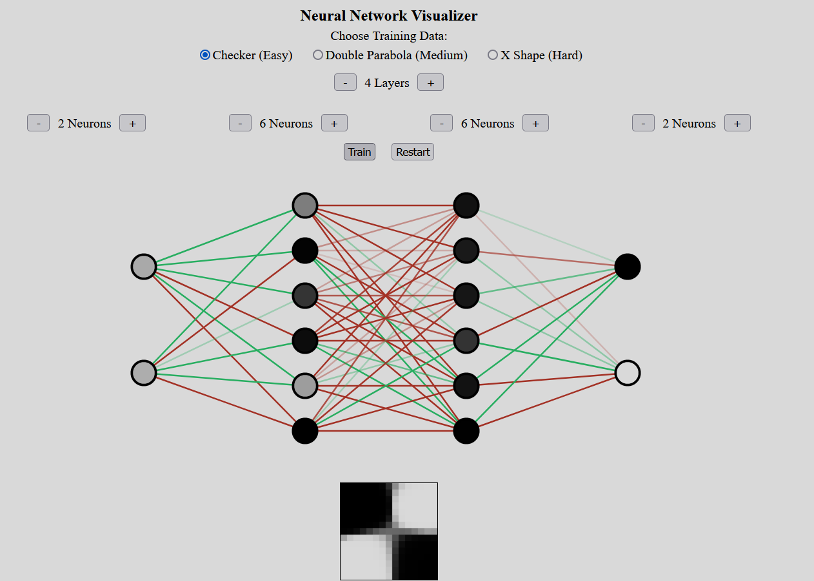

# Deep Neural Network from Scratch using Javascript
Pratham Patel
## Overview
In this project I created a deep neural network from scratch in Javascript. React was used to visualize the neural network as it learns on some simple datasets.

- The model uses softmax for the output layer, cross entropy for the loss function, and sigmoid activation in the hidden layers
- The model uses biases, however they don't show in the visualization for simplicity
- Currently the frontend only supports 2 inputs and 2 outputs (although the NeuralNetwork class works for any number of inputs/outputs)

### Visualization
- Above the model you can select the training data and model size
- Once these are selected, the train button can be clicked (then switches to pause button).
- Weights will change colour as the model learns (red = negative, green = positive, more transparent implies less negative/positive).
- The grid below the model represents the model's predictions on a cartesian plane ranging from (0, 1) for X and Y. On the grid, more white = closer to 100% prediction for class 0, more black = closer to 0% prediction for class 0. (There are only 2 output classes, so the inverse can be implied for class 1)

